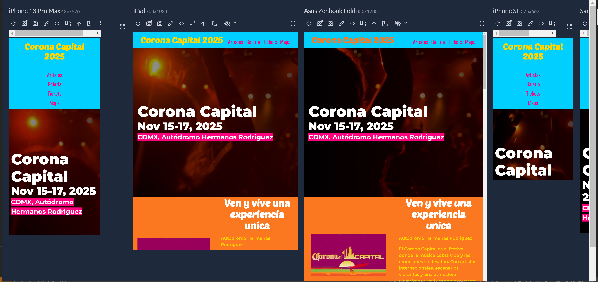

# 🎶 Corona Capital 2025 - Lineup Web Page

Este proyecto es una práctica de maquetación web en **HTML** y **SCSS** basada en el festival **Corona Capital 2025**. Se muestra el lineup de artistas distribuidos en escenarios y días, con un diseño responsive y organizado por días de evento.

## 🚀 Tecnologías utilizadas

- **HTML5**
- **SCSS (Sass)**
- **CSS Grid y Flexbox**
- **Media Queries**
- **Gulp** para la automatización de tareas

## 📂 Estructura del proyecto
src/ │ ├── img/
├── js/
├── scss/
│ ├── base/
│ ├── layout/
│ └── app.scss
├── video/
├── index.html
├── gulpfile.js
└── package.json

## 🎨 Estilos principales

- Uso de **mixins** para media queries, grid, contenedores y reset de listas.
- Variables SCSS para fuentes, colores y tamaños de media queries.
- Sistema de diseño responsive adaptado a:
  - Teléfono
  - Tablet
  - Desktop
  - Desktop XL

## 📋 Funcionalidades

- 🎟️ Muestra el lineup por **día** y **escenario** (Mainstage e Indie).
- 📱 Diseño totalmente **responsive** en la seccion de galeria, con animaciones.
- 🎥 Sección de video promocional del festival.
- 🎨 Uso de colores temáticos para diferenciar secciones.
- 💻 Código organizado siguiendo buenas prácticas de SCSS.

## 🛠️ Instalación y ejecución

1. Clona el repositorio:
   git clone https://github.com/yaiv/coronaCapital25.git
2. Instala las dependencias
   -npm install
3.Corre el proyecto
  -npm start
4.Visualiza en tu navegador local:
  -http://localhost:5000

## 📸 Vista previa del proyecto

## 📸 Vista previa del proyecto 

## ✨ Autor
Desarrollado por Yair Guerra Morales (yaiv) como práctica de maquetación web.
